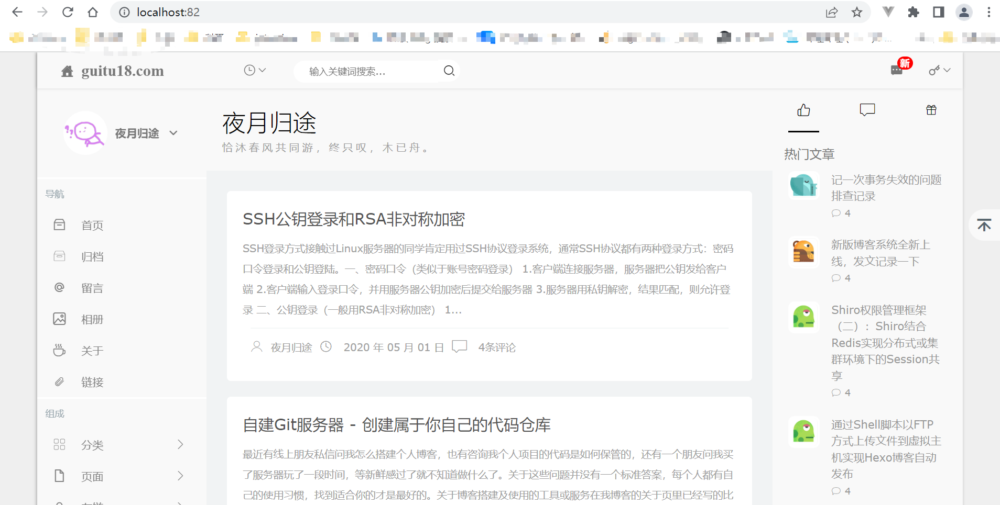
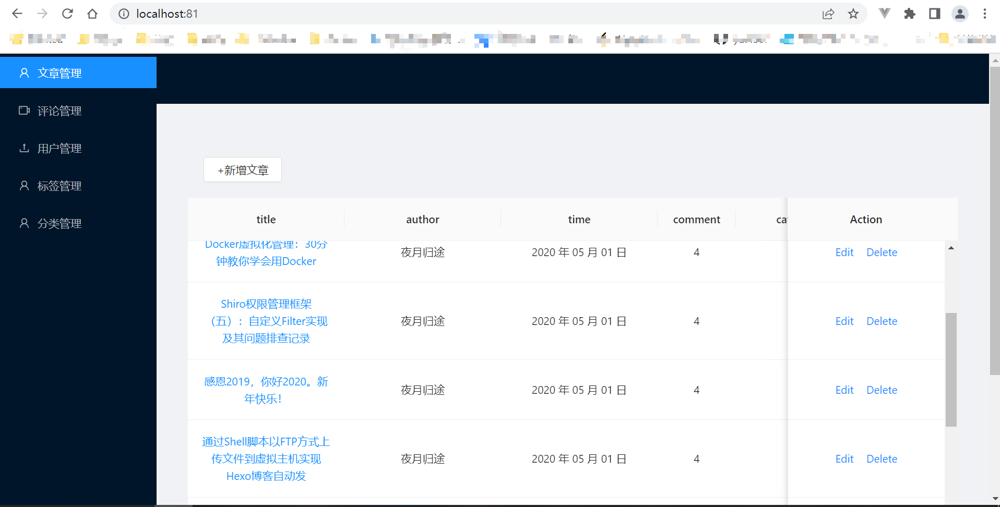

# myblogapp
this is my blog app based on react +Ant Design


项目介绍：
本项目为自己练手的个人博客项目，前端包括展示界面+后台管理系统，基于react+AntDesign构建。后端采用eggjs构建，数据库利用mongodb。

安装步骤：

1、
```
cd myblog/service
npm install

cd myblog/blog
npm install

cd myblog/admin
npm install
```
2、需要安装一下nginx（https://nginx.org ），并修改nginx.conf文件。在启动项目之前也要先启动一下nginx。

3、启动顺序

```
cd myblog/service
npm run dev

cd myblog/blog
npm run start

cd myblog/admin
npm run start

```
注意：本项目跨域采用nginx反向代理到本机的82端口，因此按上述步骤启动项目后，访问localhost:82可以看到前台界面，访问localhost:81可以看到后台管理系统界面，如图：

前台展示界面：


后台管理系统界面：



